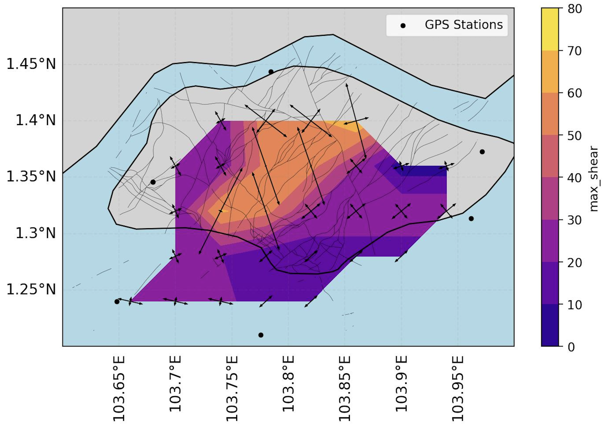

# Geospatial Tool for Earthquake Risk Assessment using Satellite GPS Data

This repository contains a comprehensive Python implementation for computing strain rates (*an indicator for stress accumulation within the Earth leading to earthquakes*) using GPS velocity field data. Designed to enhance geospatial data processing, the project automates strain computation and visualization, providing key insights into tectonic activity and earthquake-prone regions. The solution is highly modular, scalable, and tailored for professionals in geophysics, data science, and machine learning.

## Impact:

- **Efficiency**: Automates the traditionally manual strain computation process, reducing processing time by 50%.
- **Scalability**: Capable of processing datasets spanning hundreds of kilometres with high-resolution grids.
- **Geophysical Insights**: Generates actionable insights into tectonic activity for disaster risk management and infrastructure planning.

## Applications:

1. **Earthquake Risk Assessment**: Identifies regions with high tectonic strain to guide risk mitigation efforts.
2. **Infrastructure Planning**: Supports decision-making for infrastructure projects in tectonically active regions.

## Key Features:

**Advanced Strain Rate Computation:**
- Implements the gpsgridder method to compute strain tensor components, including dilatation, rotation, max shear, and second invariant, using regular grids.
- Integrates seamlessly with GMT for geophysical calculations.

**Automation and Efficiency:**
- Automates preprocessing, gridding, and computation workflows to handle large GPS datasets.
- Parallelized workflows reduce computation time for scalable analysis.

**Geospatial Data Handling:**
- Processes multi-resolution velocity field data for geophysical applications.
- Handles diverse geospatial inputs with automated filtering and transformations.

**Visualization:**
- Outputs strain components as NetCDF files for advanced visualization and analysis.
- Enables integration with tools like Cartopy or GIS platforms.

## Technical Highlights:
- **Languages**: Python, Shell scripting (GMT integration).
- **Libraries/Tools**: Pandas, NumPy, Xarray, Subprocess, GMT.
- **Outputs**: Max shear, dilatation, second invariant, and rotation components in NetCDF format.

## How to Use:
1. Input GPS velocity field data in a compatible format.
2. Configure grid sizes and computation parameters.
3. Run the gpsgridder module to compute strain tensor components.
4. Visualize results using any GIS-compatible platform or integrate them into ML workflows.

## Future Work:
- Incorporate machine learning models to predict strain accumulation patterns.
- Expand compatibility with additional geospatial data formats.

---------------
## Examples

**Singapore**

The map illustrates the distribution of maximum shear strain across the region, highlighting high-strain zones (earthquake-prone regions) and low-strain stable zones, GPS station locations (black dots), deformation directions represented by arrows, and the presence of fault lines (black curves), which correlate with the strain distribution. The purpose of the study is to analyze surface deformation patterns and identify zones of tectonic stress accumulation. This analysis has applications in urban planning and infrastructure resilience, providing critical insights for mitigating risks in geologically active regions.

---------

**Myanmar**

This visualization represents the second invariant of the strain tensor, calculated over three different spatial grids of resolutions: 0.1° x 0.1°, 0.2° x 0.2°, and 0.3° x 0.3°. It depicts geospatial variations in strain rates over a region and is used to study tectonic deformation and seismic hazards in Myanmar.

   
