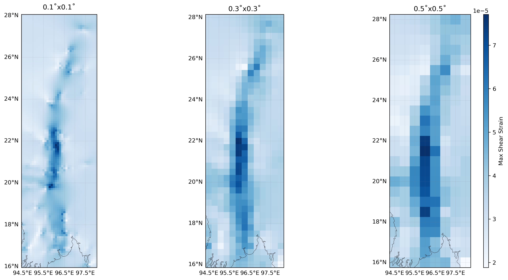

# Automated Crustal Strain Rate Assessment from GPS Velocity Fields

## 🌍 About This Project

This repository contains a Python-based data science project for computing, analyzing, and visualizing crustal strain rates from sparse GPS velocity field data. The primary objective is to transform discrete geodetic measurements into continuous strain rate fields, which are crucial for understanding tectonic deformation, plate motion, and seismic hazard assessment.

The project demonstrates a complete data processing pipeline: from ingesting raw data and leveraging specialized external tools, to performing numerical computations and creating publication-quality geospatial visualizations. It particularly highlights the analysis of how a key parameter—grid resolution—impacts the final interpolated field.

---

## 🔬 Methodology & Key Features

The analysis follows a systematic, multi-step approach to derive meaningful geophysical insights from raw data.

* **Data Ingestion**: The pipeline begins by loading sparse GPS velocity data (longitude, latitude, Ve, Vn) using the **Pandas** library.
* **Spatial Interpolation**: To estimate the continuous velocity field, the project leverages the **Generic Mapping Tools (GMT)**, a powerful and widely-used software suite in Earth Sciences. A Python class wraps the `gmt gpsgridder` command-line tool, which performs a robust bicubic spline interpolation to create a regular grid from the sparse input data.
* **Strain Rate Calculation**: Once the velocity field is gridded (stored as NetCDF files and handled with **xarray**), the strain tensor components are calculated. This involves computing the spatial gradients of the velocity field using **NumPy**. The key derived products include:
    * Maximum Shear Strain ($\dot{\epsilon}_{\text{max}}$)
    * Dilatational Strain (areal change)
    * Second Invariant of the strain rate tensor
* **Parameter Sensitivity Analysis**: The entire computation is performed iteratively over several grid resolutions (e.g., 0.1°, 0.3°, 0.5°) to analyze how the choice of grid size affects the magnitude and spatial distribution of the calculated strain rates.
* **Geospatial Visualization**: The final results are visualized as high-quality maps using **Matplotlib** and **Cartopy**, allowing for a clear comparison of the strain rate fields at different resolutions.

---

## 📊 Visualization

The final output is a comparative map of the maximum shear strain calculated at different grid resolutions, providing insight into the trade-offs between spatial detail and interpolation stability.



| **Core Language** |                                                                                                                                                                                                                                                                                                                                                                                                                                                                                                                                                                                                                            
| **Data Handling** |                                                                                                                                                                                                                                                                                                                                                                                     
| **Visualization** |                                                                                                                                                                                                                                                                                                                                                                                                                                                                                                                                                                                                                        
| **Geospatial** |                                                                                                                                                                                                                                                                                                                                                                                                             
| **Workflow** |                                                                                                                                                                                                                                                                                                                                                                                                         
---

## 🚀 How to Use

### 1. Dependencies
This project requires Python and several libraries. The core geospatial processing depends on an external command-line tool, **Generic Mapping Tools (GMT)**.

* **Python Libraries**: Install the necessary libraries using `pip` or `conda`.
    ```bash
    pip install numpy pandas xarray matplotlib cartopy
    ```
* **GMT**: You must have GMT installed and accessible from your command line. For installation instructions, please see the [official GMT documentation](https://www.generic-mapping-tools.org/download/).

### 2. Setup
* Clone this repository to your local machine.
* Place your input GPS velocity data file (e.g., `mymr_vel_space_ITRF2014.txt`) into the `data/` directory.
* Open the `strain_rates_compute.ipynb` notebook and ensure the `input_file` path variable points to your data file.

### 3. Running the Analysis
* Execute the cells in the Jupyter Notebook sequentially.
* The script will:
    1.  Call GMT to grid the velocity data.
    2.  Calculate the strain rate components.
    3.  Save the output grids as NetCDF files in the `Output_gpsgridder/` directory.
    4.  Generate and display the final comparison plot.


   
